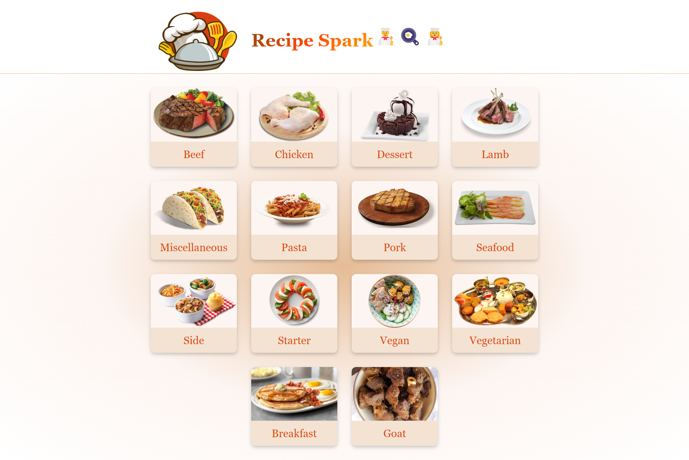
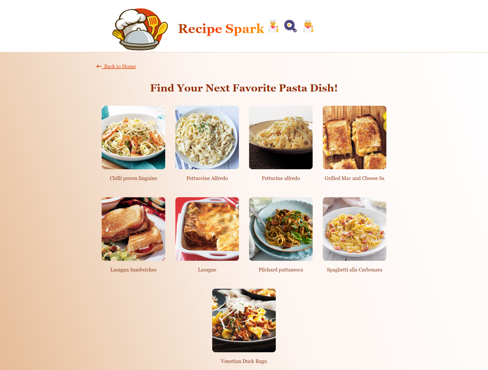
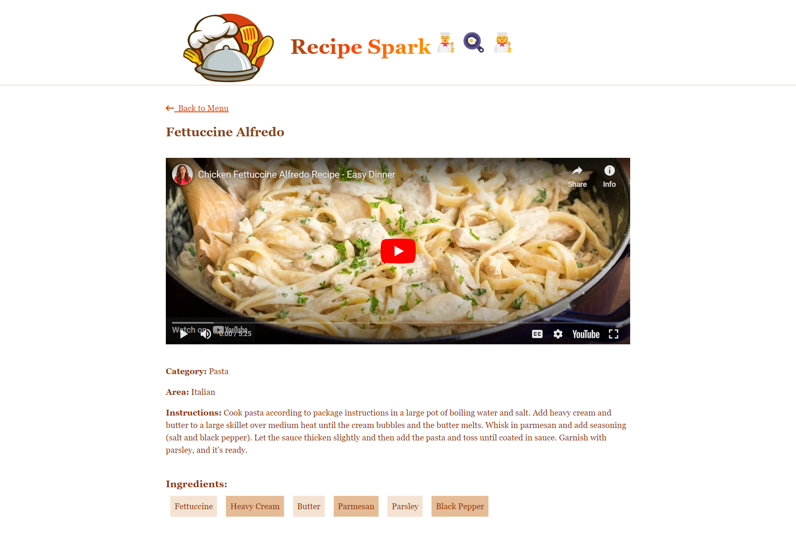

# Recipe Spark

**Recipe Spark** is a React-based responsive website that allows users to explore a wide variety of recipes from the MealDB API. The app consists of three main pages: **Menu**, **Category**, and **Recipe**.

## Project History
This project was originally developed during a hackathon I participated in, and later enhanced with additional styling in this repository.

## Features

- **Menu Page**: The homepage that displays a list of available categories of meals.
- **Category Page**: Shows a collection of meals for a selected category.
- **Recipe Page**: Displays detailed information about a specific recipe, including ingredients, instructions, and a meal image.






## Tech Stack

- **React**: Frontend framework for building the user interface.
- **MealDB API**: External API used to fetch meal and recipe data.
- **React Router**: For navigation between different pages.
- **Axios** : Used to make API requests.
- **SCSS**: Used for styling the application.

## Installation

### Prerequisites

- **Node.js** (v14 or above)
- **npm** or **yarn**

### Steps to Set Up

1. **Clone the repository**:
    ```bash
    git clone https://github.com/your-username/recipe-spark.git
    ```

2. **Navigate to the project directory**:
    ```bash
    cd recipe-spark
    ```

3. **Install the dependencies**:
    ```bash
    npm install
    ```
    or
    ```bash
    yarn install
    ```

4. **Run the development server**:
    ```bash
    npm start
    ```
    or
    ```bash
    yarn start
    ```

5. **Open your browser** and navigate to:
    ```
    http://localhost:3000    ```


### Key Files

- **`App.js`**: The main component that handles routing and overall layout.
- **`Menu.js`**: Component for displaying meal categories fetched from the MealDB API.
- **`Category.js`**: Component that shows meals based on the selected category.
- **`Recipe.js`**: Component that provides detailed information about a specific meal, including the recipe.

## Pages

1. **Menu Page**:
   - Fetches and displays a list of meal categories from the MealDB API.
   - Clicking on a category takes you to the Category Page.

2. **Category Page**:
   - Shows a list of meals under a selected category.
   - Clicking on a meal directs you to the Recipe Page.

3. **Recipe Page**:
   - Displays details of a selected meal, including ingredients and cooking instructions.

## API Usage

This project uses the [MealDB API](https://www.themealdb.com/api.php) to fetch data. Below are the key endpoints used:

- **Categories**: `https://www.themealdb.com/api/json/v1/1/categories.php`
- **Meals by Category**: `https://www.themealdb.com/api/json/v1/1/filter.php?c={category_name}`
- **Meal Details**: `https://www.themealdb.com/api/json/v1/1/lookup.php?i={meal_id}`

## Styling

- The app uses **SCSS** for styling, with modular and reusable styles.
- You can find all the styles in the `src/styles` directory.

## Future Enhancements

- **Search Functionality**: Add a global search feature to search for meals by name.
- **Favorites**: Allow users to mark meals as favorites and save them.
- **User Authentication**: Enable user accounts for personalized recipe recommendations.


